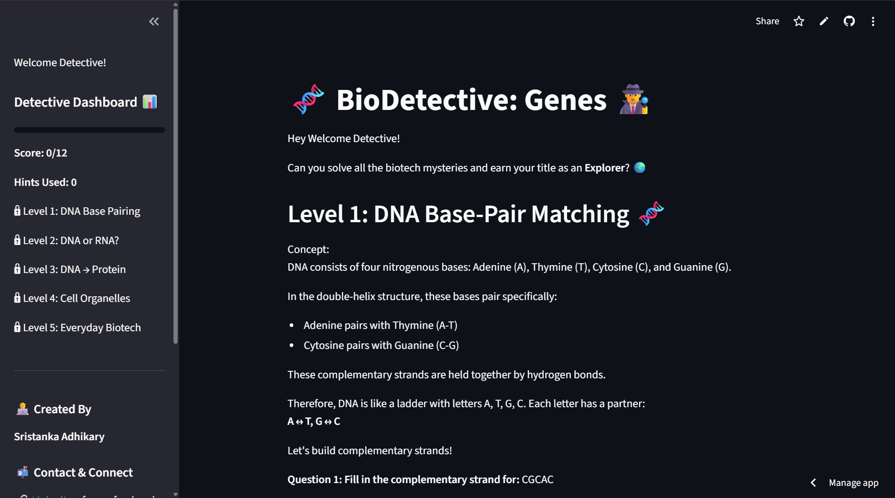
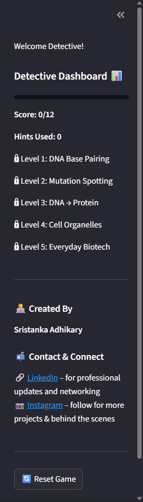
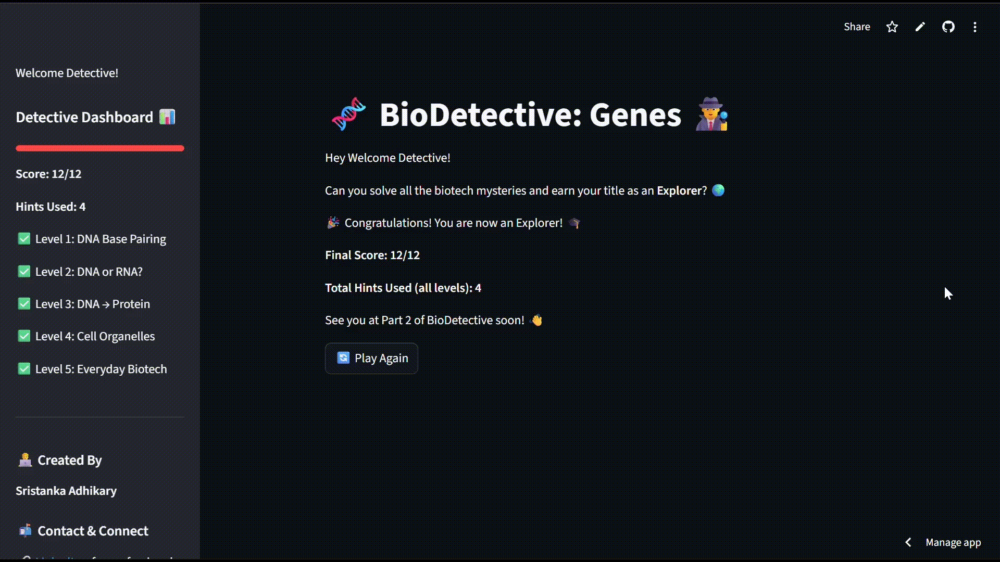

# 🧬 BioDetective: Genes 🕵️‍♂️

## Introduction

**BioDetective: Genes** is an interactive learning game built with **Streamlit** that makes biotechnology concepts fun and hands-on.
Solve puzzles, spot mutations, translate DNA → protein, and become a true **BioExplorer**! 🚀

---

## Table of Contents

* [Game Overview](#game-overview)
* [Features](#features)
* [Screenshots](#screenshots)
* [Installation](#installation)
* [Usage](#usage)
* [Project Structure](#project-structure)
* [Author](#author)
* [License](#license)
* [Next Steps](#next-steps)

---

## Game Overview

The game has **5 progressive levels**:

| Level | Concept           | Activity                                    |
| ----- | ----------------- | ------------------------------------------- |
| 1     | DNA Base Pairing  | Build complementary DNA strands (A↔T, G↔C)  |
| 2     | DNA Vs RNA        | Identify whether given strand is DNA or RNA |              |
| 3     | DNA → Protein     | Translate mRNA codons into amino acids      |
| 4     | Cell Organelles   | Match organelles to their cellular roles    |
| 5     | Everyday Biotech  | Connect biotech products to their processes |

Players graduate from **Detective 🕵️** to **Explorer 🎓** with their score and hints summary.

---

## Features

* 📖 Concept + Fun: Each level teaches real biotech concepts in simple language.
* 💡 Hints System: Players can take hints (tracked in score).
* ✅ Answer Check: Immediate feedback with explanations.
* 📊 Sidebar Dashboard: Live progress bar, score, and hints used.
* 🎉 Celebrations: Balloon animations on level completion.
* 🔄 Reset/Replay: Start over anytime.

---

## Screenshots

Here are some key screenshots of the game:

### Home Screen / Level 1



### Sidebar with Score & Hints



### Final Completion Screen (GIF Demo)



---

## Installation

1. **Clone the repository**

```bash
git clone https://github.com/sristanka/BioDetective-Genes.git
cd biodetective-genes
```

2. **Install dependencies**

```bash
pip install -r requirements.txt
```

`requirements.txt` should include:

```
streamlit
pillow
```

---

## Usage

Run the Streamlit app:

```bash
streamlit run main.py
```

---

## Project Structure

```
BioDetective-Genes/
│
├── level1.py       # DNA Base Pairing
├── level2.py       # Mutation Spotting
├── level3.py       # DNA → Protein
├── level4.py       # Cell Organelles
├── level5.py       # Everyday Biotech
│
├── utils.py        # Helper functions
├── main.py         # Main Streamlit app
├── codon_table.png # Codon chart for Level 3
├── screenshots/    # Screenshots and GIFs
└── README.md       # Documentation
```

---

## Author

Created with ❤️ by **Sristanka Adhikary**

* 🔗 LinkedIn: Sristanka Adhikary
* 📷 Instagram: @btwsris

---

## License

**All rights reserved.**

This project is not licensed for public use or modification.
You may view the code and project, but any redistribution or commercial use is prohibited without permission.

---

## Next Steps

This is **Part 1** of the BioDetective series.

Stay tuned for **BioDetective: Part 2**! 🎮

